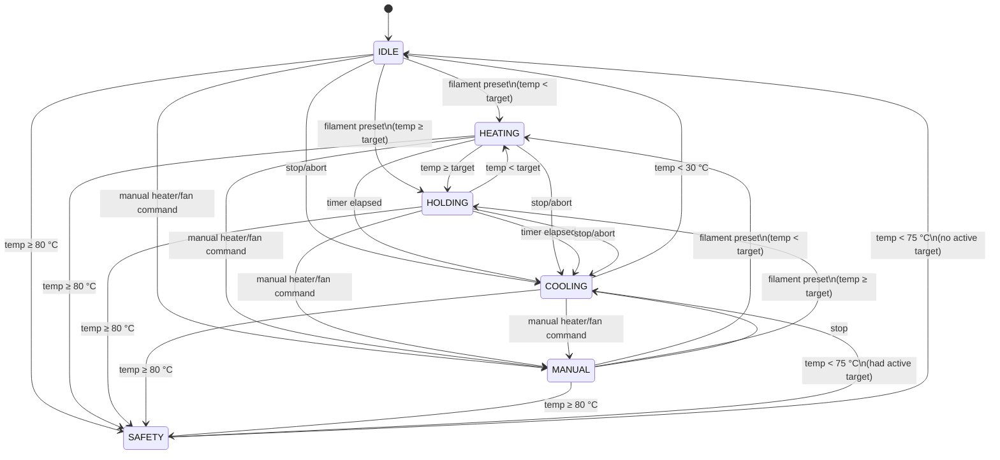

# Filament Dryer


## Motivation

After my Eibos Cyclopes filament dryer stopped working, I repurposed its PTC heating element and case into a custom ESP8266-controlled dryer with WiFi, MQTT, an OLED display, and physical buttons — instead of throwing still-usable hardware away.


## Hardware

| Component | Part |
|---|---|
| Microcontroller | ESP8266 Wemos D1 Mini |
| Sensor | DHT11 (temp + humidity) |
| Heater relay | Active-High, NO |
| Fan relay | Active-High, NC (failsafe: fan runs on power loss) |
| Display | 128×64 SSD1306 OLED, I2C |
| Buttons | 2× MX keyboard switch (2-pin, no LED) |
| PTC heater | 220V, repurposed from Eibos Cyclopes |
| Power supply | 220V → 5V DC |

## Setup — WiFi & MQTT credentials

Credentials are configured via a captive portal — no hardcoding, no recompiling.

**First boot:**
1. Device starts as WiFi AP: **"Dryer-Setup"**
2. Connect to that network — browser opens automatically
3. Enter WiFi SSID/password and MQTT broker details
4. Save → device restarts and connects

**Reset credentials:**
- Power cycle 5× within 10 s → device clears credentials and re-enters AP mode
- Or send MQTT command: `cmnd/dryer/config` → `{"action": "reset"}`

## Physical controls

| Button | Pin | Short press | Long press (3 s) |
|---|---|---|---|
| SELECT | D7 | Cycle through filament presets | — |
| ENTER | D4 | Start drying with selected preset | Graceful stop (fan cools to <30 °C) |

Display shows current state (left) and selected preset (right) on the top line.

## MQTT API

All payloads are JSON.

### Commands (subscribe)

| Topic | Payload | Effect |
|---|---|---|
| `cmnd/dryer/filament` | `{"material": "PLA"}` | Start drying with preset |
| `cmnd/dryer/control` | `{"action": "stop"}` | Graceful stop → COOLING → IDLE |
| `cmnd/dryer/control` | `{"action": "abort"}` | Immediate stop → IDLE |
| `cmnd/dryer/heater` | `{"state": "on/off"}` | Manual heater override |
| `cmnd/dryer/fan` | `{"state": "on/off"}` | Manual fan override |
| `cmnd/dryer/config` | `{"action": "reset"}` | Wipe credentials → AP mode |

### Telemetry (publish)

Topic: `tele/dryer/state` — every second.

```json
{
  "state": "HEATING",
  "humidity": 42.0,
  "currentTemperature": 51.3,
  "targetTemperature": 50,
  "remainingTime": 218,
  "heaterState": true,
  "fanState": true
}
```

## Filament presets

| Material | Temp (°C) | Time |
|---|---|---|
| PLA | 50 | 4 h |
| ABS | 60 | 2 h |
| PETG | 65 | 2 h |
| NYLON | 70 | 2 h |
| PC | 70 | 8 h |
| TPU | 55 | 4 h |
| PVA | 50 | 4 h |
| ASA | 60 | 4 h |
| PP | 55 | 6 h |

## State machine



| State | Heater | Fan | Description |
|---|---|---|---|
| IDLE | off | off | No active drying cycle |
| HEATING | on | on | Temperature below target |
| HOLDING | off | on | At target, fan circulates air |
| COOLING | off | on | Cycle done or stopped, cooling down |
| MANUAL | — | — | Fully controlled via MQTT |
| SAFETY | off | on | Over-temperature cutoff (≥ 80 °C, hysteresis 75 °C) |

## Build & flash

Requires [PlatformIO](https://platformio.org/).

```bash
# Build
~/.platformio/penv/bin/pio run

# Flash
~/.platformio/penv/bin/pio run --target upload

# Serial monitor
~/.platformio/penv/bin/pio device monitor
```

> If upload fails with "Invalid head of packet": erase flash first with
> `~/.platformio/penv/bin/pio run --target erase`, then upload again.
> After erasing, LittleFS credentials are wiped — re-provision via AP mode.

## License

MIT License — use, modify, distribute freely with attribution.
